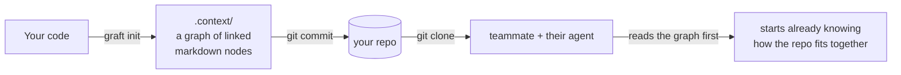

<div align="center">

<!-- placeholder: swap for the Graft logo asset when ready -->
<!--  -->

# Graft

**Your coding agent reads 30 files to change 3.**
**Graft gives it the map it should have read first.**

<p>
  <a href="https://www.npmjs.com/package/graft"></a>
  <a href="https://www.npmjs.com/package/graft"></a>
  <a href="https://nodejs.org"></a>
  
  
  
</p>

**31% fewer tool calls · 23% less cost · 17% lower latency.** That is what an agent gets from reading the graph first instead of going in cold.

</div>

<!-- placeholder: swap this diagram for a produced hero gif/screenshot (assets/hero.gif) when ready -->



---

## Quick start

```bash
npx graft init
# builds .context/ from your code, one node per system, API, or concept

git add .context && git commit -m "add context graph"
# commit it so everyone who clones the repo (and their agents) gets the graph
```

<!-- placeholder: package publish + `graft` rename pending; until then the bin is `context-graph` -->

That is it. Point your agent at `.context/` and it reads the graph before it starts working.

---

## The problem

Every task, your coding agent starts blind. Before it changes anything, it re-explores the repo: grep a term, open a file, follow an import, back out, try again. It is rebuilding a picture of a codebase it mapped an hour ago and threw away. That rediscovery burns most of a run's tool calls, tokens, and latency, and it is pure overhead:

- **Repeated.** Every task pays the exploration cost again, from zero.
- **Discarded.** Whatever the agent figured out dies with the session.
- **Unshared.** The next teammate, and their agent, start from scratch too.

Humans onboard to a codebase once. Agents onboard every single time.

---

## What Graft does

Graft builds that understanding **once** and writes it into your repo as a folder of linked markdown files, one node per system, API, or concept.

- **Real explanations, not a list of symbols.** Each node says, in plain English, what a part of the system does and how it connects to the rest, the way a senior engineer would explain it. That is the part an agent actually needs so it can skip the exploration. It is not a dump of function names.
- **A real graph you can read.** No embeddings, no similarity search, no index to keep warm. The graph is a set of linked files your agent opens, greps, and follows, exactly the way it reads any other file in the repo.
- **Grafted into git.** The graph is just files in `.context/`. Commit it, and anyone who clones the repo has it. No database, no server, no setup. Git does the syncing, and a stale graph shows up as a diff in review instead of rotting in some external store.
- **The diff lives with the code.** When a change moves things around, you see it in the graph diff in the same pull request, right next to the code that caused it.
- **Local by default.** The graph builds with a local model, so your code stays on your machine. Cloud models are opt-in for richer summaries.

---

## How the graph gets built

Graft builds the graph in two passes, both powered by a language model:

1. **Read each file.** Every source file is summarized once into a short description of what it does.
2. **Group into nodes.** Those summaries are grouped into a curated set of nodes (subsystems, key files, and concepts) with typed links between them. Graft chooses the right level of detail for you instead of making one node per file, so a big repo becomes a few dozen readable nodes.

Both passes are cached by content hash. Re-running only touches the files that changed, so the second build is fast and cheap.

---

## What's in a node

A node is a single markdown file. Most code maps stop at an address: this thing lives in that file, on that line. That tells an agent where to look, not what it will find, so it still has to open the source and read. A Graft node holds the meaning inline, so the agent learns what it needs up front and opens the file only when it wants more.

Each node holds:

| Part | What it holds |
|---|---|
| **Summary** | A plain-English explanation of what the code does, written by the model and cached. It is there whether or not the code was ever documented, and it is regenerated when the source changes. |
| **Crux** | The handful of lines that actually carry the logic: the guard, the skip condition, the state change. Lifted straight from the source and stored inline, so the agent sees *how* it works, not just what. |
| **Sources** | The exact files the node is built from, each tracked by a content hash, so Graft can tell precisely when a node has gone stale. |
| **Links** | Typed connections to other nodes (`depends_on`, `part_of`, `uses`, `implements`, `produces`), written as `[[wikilinks]]` your agent can follow. |
| **Notes** | Anything you write below the generated block. It is preserved across regenerations, so your own context is never overwritten. |

That is three depths in one file: the summary says *what* the code does, the crux shows *how*, and the sources point to the rest if the agent needs it. A plain index makes it read a whole file to learn one thing. A Graft node hands it the answer inline, and the follow-up read often never happens.

The crux is stored as the code itself, not as a line range, on purpose. Line numbers drift whenever unrelated code above them shifts, but the lines that matter do not. Keeping the text, not the numbers, means the crux stays correct even as the file around it moves.

_Summary, sources, links, and notes ship today. The inline crux excerpt is rolling out as the node schema lands._

---

## Keeping it honest (CI)

A graph that has drifted from the code is worse than no graph. `graft check` compares each node's tracked source hashes against the current files and fails if the graph is stale. Drop it in CI so a pull request cannot merge with an out-of-date map.

```bash
graft check          # exits non-zero if .context/ has drifted
graft check --json   # machine-readable drift report
```

<!-- placeholder: planned, not yet in the CLI -->
> **Planned: auto-sync on commit.** `graft hook install` will add a post-commit hook that regenerates changed nodes automatically, so the graph stays current without anyone remembering to run `init`. Until then, regenerate with `graft init` and commit it alongside your code.

---

## Runs locally

Everything runs on your machine. No accounts, no cloud calls, no keys required.

- **Default.** A local model via [Ollama](https://ollama.com) builds the graph. Nothing leaves your machine.
- **Optional.** Set `OPENROUTER_API_KEY` to use a cloud model for richer summaries. Pass `--local` to force local even when a key is set.
- **No telemetry** and no analytics.

See [`.env.example`](.env.example) for the full list of settings (model names, base URLs).

---

## CLI

Two commands. That is the whole surface.

```bash
graft init [dir]                     # build .context/ from the code at [dir] (default: .)
graft init --extensions .ts .py      # only include these code extensions
graft init --local                   # force local Ollama even if OPENROUTER_API_KEY is set

graft check [dir]                    # fail (exit 1) if .context/ has drifted from the code
graft check --json                   # print the drift report as JSON

# global
graft --dir <path>                   # use a context dir other than <repo>/.context
```

---

## Standard session vs. Graft

The test is a real 344-file repo. `graft init` turns it into 41 nodes. Then the same coding agent, with the same file tools, runs the same tasks two ways: one goes in cold, the way a standard session starts, and the other reads the graph first.

| Per task | Standard session (cold) | With Graft |
|---|---|---|
| Tool calls | baseline | **31% fewer** |
| Cost | baseline | **23% less** |
| Latency | baseline | **17% lower** |
| Correctness | baseline | **at least as good** |

Same model, same tools, same tasks. The only difference is whether the agent got the graph up front. Correctness is scored by a separate model against a reference answer, with a required-keyword floor, so a fast-but-wrong run cannot post a win.

The graph is not magic. Reading a handful of linked nodes just beats rediscovering the codebase from scratch on every task.

Reproduce it yourself:

```bash
npm run bench -- --smoke   # 1 corpus, 1 task, a quick plumbing check
npm run bench              # full: all corpora, all tasks
```

See [`bench/README.md`](bench/README.md) for the method and how to add your own repo.

---

## Development

```bash
git clone https://github.com/nanonets/graft.git && cd graft
npm install
npm run build
npm test

npm run cli -- init .      # run the CLI from source
```

<!-- placeholder: confirm repo URL once published -->

---

## License

MIT. See [LICENSE](LICENSE).
